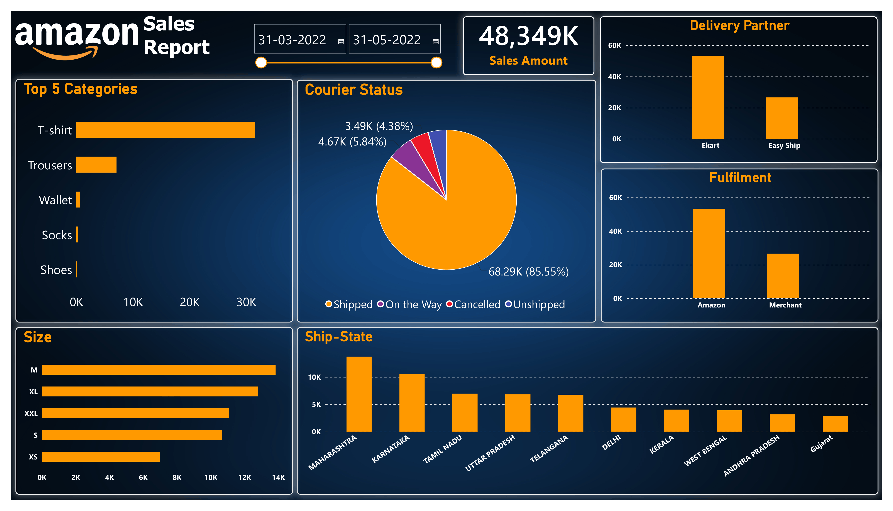

# Amazon Sales Analysis
## Project Overview
This project focuses on analyzing an Amazon sales dataset using Excel and Power BI.
The project covers data cleaning and preparation in Excel, followed by data transformation and dashboard creation in Power BI to understand sales performance across different categories, courier statuses, fulfilment methods, sizes, delivery partners, and states.
## Tools Used
- Excel
- Power BI
## Dataset
The dataset contains Amazon sales records with information such as:
- Order status
- Fulfilment
- Sales channel
- Shipping service level
- Product category
- Size
- Courier status
- Quantity
- Amount
- Shipping city and state
- B2B information
- Fulfilled-by details
## Data Cleaning
The raw dataset was cleaned using Excel.
The main cleaning steps included:
- Removed blank/unwanted rows
- Removed duplicate records
- Removed unnecessary columns
- Prepared the dataset for further analysis
## Data Transformation
After cleaning the data in Excel, the dataset was imported into Power BI.
Power BI Transform Data was used to:
- Check the data structure
- Verify data types
- Change data types where required
- Prepare the data for dashboard analysis
## Dashboard Analysis
The Power BI dashboard includes:
- Total Sales Amount
- Top 5 Categories
- Courier Status Analysis
- Delivery Partner Analysis
- Fulfilment Analysis
- Size Analysis
- Ship-State Analysis
- Date Range Filter
## Key Metrics
- Total Sales Amount: ₹48.35M approximately
- Courier status and fulfilment were analyzed to understand order distribution
- Product categories were compared to identify high-volume categories
- Orders were analyzed across different sizes
- State-wise order distribution was visualized
## Dashboard Preview

## Project Files
- `1_amazon_sales_data.xlsx` — Cleaned Excel dataset
- `2_amazon_sales_dashboard.png` — Power BI dashboard preview
- `README.md` — Project documentation
## Workflow
Raw Data  
↓  
Excel Data Cleaning  
↓  
Power BI Data Transformation  
↓  
Dashboard Creation  
↓  
Sales Analysis & Visualization
## Learning Outcome
Through this project, I gained practical experience in:
- Data cleaning using Excel
- Data preparation and transformation using Power BI
- Creating business dashboards
- Using charts and KPIs for data visualization
- Presenting sales data in an easy-to-understand format
## Disclaimer
This project is created for learning and portfolio purposes using a sales dataset. It does not represent confidential or proprietary Amazon business data.
